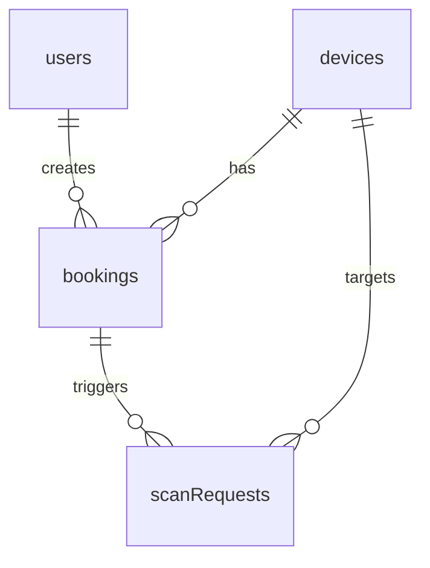

# Database Schema

## Overview

The PBL5 Lab Manager uses Firebase Cloud Firestore as its primary database. The database stores users, devices, bookings, and scan requests.

## Collections

| Collection | Purpose |
|-----------|---------|
| users | User profiles and face data |
| devices | Lab device status |
| bookings | Device bookings |
| scanRequests | Face scan requests |

## users Collection

### Document Structure

```
users/{uid}
```

| Field | Type | Description |
|-------|------|-------------|
| name | string | User's full name |
| email | string | User's email |
| role | string | "user" or "admin" |
| num | string | Student/Employee number |
| job | string | Job title/role |
| birthday | string | Birthday (DD/MM/YYYY) |
| faceImageUrls | array | List of 5 face image URLs |
| embeddingStatus | string | "pending", "processing", "done", "failed" |
| embeddingUpdatedAt | timestamp | Last embedding update |
| embeddingCount | number | Number of successful embeddings |
| embeddingError | string | Error message if failed |
| createdAt | timestamp | Account creation time |
| updatedAt | timestamp | Last update time |

### Example Document

```json
{
  "uid": "VAwQ9sogfLTbE4fAUkiEbAQAUeh1",
  "name": "John Doe",
  "email": "john@example.com",
  "role": "user",
  "num": "SV123456",
  "job": "Student",
  "birthday": "01/01/2000",
  "faceImageUrls": [
    "https://firebasestorage.googleapis.com/v0/b/.../face_0.jpg",
    "https://firebasestorage.googleapis.com/v0/b/.../face_1.jpg",
    "https://firebasestorage.googleapis.com/v0/b/.../face_2.jpg",
    "https://firebasestorage.googleapis.com/v0/b/.../face_3.jpg",
    "https://firebasestorage.googleapis.com/v0/b/.../face_4.jpg"
  ],
  "embeddingStatus": "done",
  "embeddingUpdatedAt": "2024-01-15T10:30:00Z",
  "embeddingCount": 5,
  "embeddingError": null,
  "createdAt": "2024-01-10T08:00:00Z",
  "updatedAt": "2024-01-15T10:30:00Z"
}
```

## devices Collection

### Document Structure

```
devices/{deviceId}
```

| Field | Type | Description |
|-------|------|-------------|
| name | string | Device name |
| status | string | "ready", "in_use", "maintenance" |
| currentUserId | string? | User currently using device |
| currentUserName | string? | Name of current user |
| description | string | Device description |
| location | string | Device location |
| updatedAt | timestamp | Last status update |

### Example Documents

```json
{
  "deviceId": "dev01",
  "name": "Máy in 3D Ender 3",
  "status": "ready",
  "currentUserId": null,
  "currentUserName": null,
  "description": "Ender 3 Pro 3D Printer",
  "location": "Lab bench 1",
  "updatedAt": "2024-01-15T10:00:00Z"
}
```

```json
{
  "deviceId": "dev02",
  "name": "Kính hiển vi",
  "status": "in_use",
  "currentUserId": "VAwQ9sogfLTbE4fAUkiEbAQAUeh1",
  "currentUserName": "John Doe",
  "description": "Olympus CX23 Microscope",
  "location": "Lab bench 2",
  "updatedAt": "2024-01-15T11:30:00Z"
}
```

## bookings Collection

### Document Structure

```
bookings/{bookingId}
```

| Field | Type | Description |
|-------|------|-------------|
| userId | string | User UID |
| userName | string | User's full name |
| deviceId | string | Device ID |
| deviceName | string | Device name |
| startTime | timestamp | Booking start time (UTC) |
| endTime | timestamp | Booking end time (UTC) |
| status | string | "pending", "approved", "using", "finished", "cancelled" |
| createdAt | timestamp | Booking creation time |
| updatedAt | timestamp | Last update time |
| approvedAt | timestamp | Admin approval time |
| finishedAt | timestamp | Completion time |

### Booking Status Flow

```
pending -> approved -> using -> finished
              |
              v
           cancelled
```

### Example Documents

```json
{
  "bookingId": "bk001",
  "userId": "VAwQ9sogfLTbE4fAUkiEbAQAUeh1",
  "userName": "John Doe",
  "deviceId": "dev01",
  "deviceName": "Máy in 3D Ender 3",
  "startTime": "2024-01-15T14:00:00Z",
  "endTime": "2024-01-15T16:00:00Z",
  "status": "approved",
  "createdAt": "2024-01-14T10:00:00Z",
  "updatedAt": "2024-01-14T12:00:00Z",
  "approvedAt": "2024-01-14T12:00:00Z",
  "finishedAt": null
}
```

## scanRequests Collection

### Document Structure

```
scanRequests/{requestId}
```

| Field | Type | Description |
|-------|------|-------------|
| userId | string | User UID who requested scan (can be null for hardware button) |
| deviceId | string | Device ID |
| status | string | "pending", "scanning", "success", "denied", "failed", "error" |
| recognizedUserId | string? | Recognized user ID |
| score | number? | Recognition score |
| bookingId | string? | Associated booking ID |
| message | string | Status message |
| createdAt | timestamp | Request creation time |
| updatedAt | timestamp | Last update time |

### Status Values

| Status | Description |
|--------|-------------|
| pending | Waiting for scan |
| scanning | Currently scanning |
| success | Access granted |
| denied | Access denied |
| failed | Scan failed |
| error | Error occurred |

### Example Document

```json
{
  "requestId": "sr001",
  "userId": "VAwQ9sogfLTbE4fAUkiEbAQAUeh1",
  "deviceId": "dev01",
  "status": "success",
  "recognizedUserId": "VAwQ9sogfLTbE4fAUkiEbAQAUeh1",
  "score": 0.85,
  "bookingId": "bk001",
  "message": "Xác thực thành công, thiết bị đã được mở",
  "createdAt": "2024-01-15T14:05:00Z",
  "updatedAt": "2024-01-15T14:05:15Z"
}
```

## Relationships



### User -> Bookings

One user can have multiple bookings:

```
users/{uid} -> bookings (via userId field)
```

### Device -> Bookings

One device can have multiple bookings:

```
devices/{deviceId} -> bookings (via deviceId field)
```

### Device -> Scan Requests

One device can have multiple scan requests:

```
devices/{deviceId} -> scanRequests (via deviceId field)
```

## Indexes

The following Firestore indexes are required:

| Collection | Query | Fields |
|-----------|-------|--------|
| bookings | User bookings | userId, status |
| bookings | Device bookings | deviceId, status |
| bookings | Active bookings | deviceId, status, startTime |
| scanRequests | Pending requests | deviceId, status |

## Security Rules

```javascript
rules_version = '2';
service cloud.firestore {
  match /databases/{database}/documents {
    // Users can read their own profile
    match /users/{userId} {
      allow read: if request.auth != null && request.auth.uid == userId;
      allow write: if request.auth != null && request.auth.uid == userId;
    }

    // Admins can read all users
    match /users/{userId} {
      allow read: if request.auth != null &&
        get(/databases/$(database)/documents/users/$(request.auth.uid)).data.role == 'admin';
    }

    // Authenticated users can read devices
    match /devices/{deviceId} {
      allow read: if request.auth != null;
    }

    // Admins can write devices
    match /devices/{deviceId} {
      allow write: if request.auth != null &&
        get(/databases/$(database)/documents/users/$(request.auth.uid)).data.role == 'admin';
    }

    // Users can create bookings
    match /bookings/{bookingId} {
      allow create: if request.auth != null &&
        request.resource.data.userId == request.auth.uid;
      allow read: if request.auth != null;
      allow update: if request.auth != null;
    }

    // Admins can manage all bookings
    match /bookings/{bookingId} {
      allow delete: if request.auth != null &&
        get(/databases/$(database)/documents/users/$(request.auth.uid)).data.role == 'admin';
    }

    // Raspberry Pi service account can write scanRequests
    match /scanRequests/{requestId} {
      allow read, write: if request.auth.token.email == 'raspberry@pbl5-lab.firebaseadmin.com';
    }
  }
}
```

## Data Migration

### Adding embedding fields to users

```javascript
// Firestore migration script
const db = admin.firestore();

async function migrate() {
  const snapshot = await db.collection('users').get();

  snapshot.forEach(async (doc) => {
    const data = doc.data();
    if (!data.embeddingStatus) {
      await doc.ref.update({
        embeddingStatus: 'pending',
        embeddingCount: 0,
        embeddingError: null
      });
    }
  });
}
```

## Backup

### Export Firestore

```bash
gcloud firestore export gs://pbl5-lab-backup/$(date +%Y%m%d)
```

### Import Firestore

```bash
gcloud firestore import gs://pbl5-lab-backup/20240115
```

## Monitoring

### Firestore Usage

View Firestore usage in Firebase Console:
- Firebase Console -> Firestore -> Usage

### Key Metrics

| Metric | Description |
|--------|-------------|
| Document reads | Number of document reads |
| Document writes | Number of document writes |
| Document deletes | Number of document deletes |
| Storage | Total storage used |