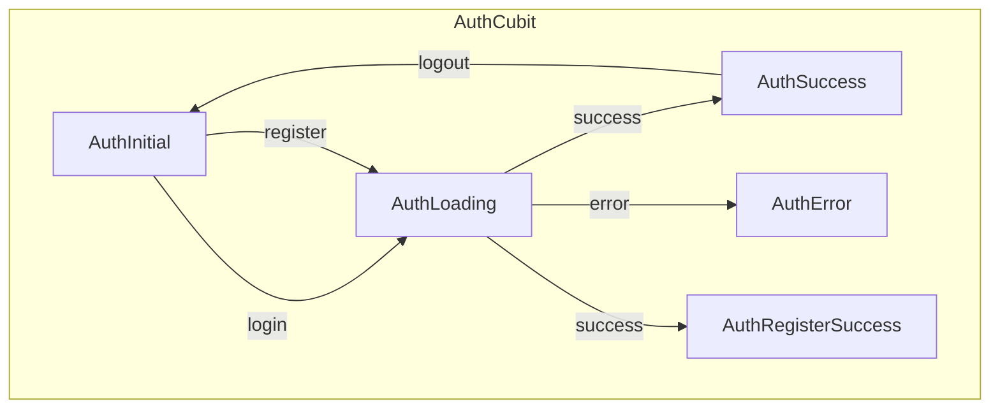
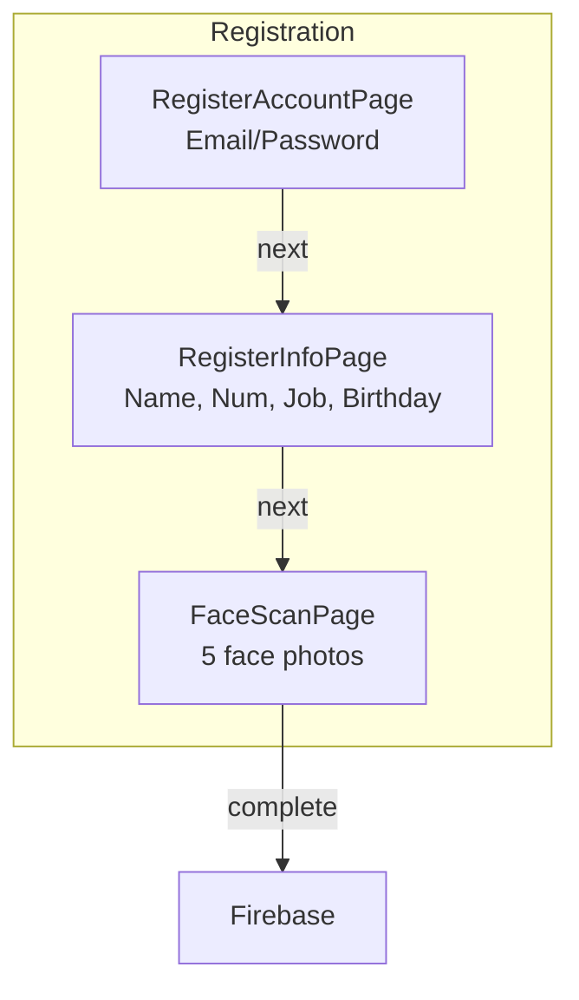
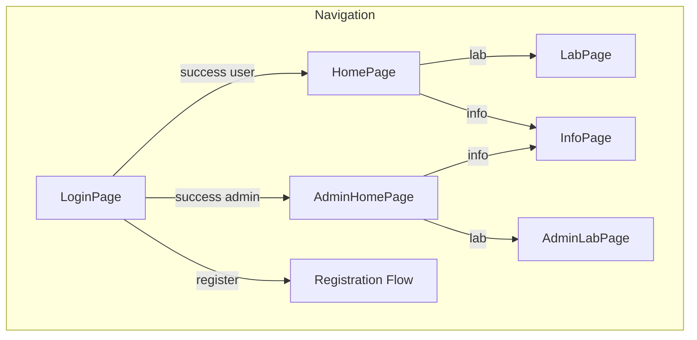

# Mobile App Documentation

## Overview

The PBL5 Lab Manager mobile app is built with Flutter using the BLoC pattern (flutter_bloc) for state management. It provides user authentication, device booking, and administrative features.

## Architecture

### Technology Stack

- **Framework**: Flutter 3.0+
- **State Management**: flutter_bloc (Cubit pattern)
- **Backend**: Firebase (Auth, Firestore, Storage)
- **Face Detection**: google_mlkit_face_detection

### Project Structure

```
mobile_app/
├── lib/
│   ├── main.dart                    # App entry point
│   ├── core/
│   │   ├── models/                  # Data models
│   │   │   ├── user_model.dart
│   │   │   ├── device_model.dart
│   │   │   └── booking_model.dart
│   │   ├── services/
│   │   │   ├── auth_service.dart     # Firebase Auth
│   │   │   └── firestore_service.dart  # Firestore operations
│   │   ├── theme/
│   │   │   └── app_theme.dart
│   │   └── utils/
│   │       └── image_converter.dart
│   └── modules/
│       ├── auth/
│       │   ├── presentation/
│       │   │   ├── application/
│       │   │   │   └── cubit/
│       │   │   │       ├── auth_cubit.dart
│       │   │   │       └── auth_state.dart
│       │   │   └── components/
│       │   │       ├── login_page.dart
│       │   │       ├── register_account_page.dart
│       │   │       ├── register_info_page.dart
│       │   │       └── face_scan_page.dart
│       │   └── repository/
│       │       └── auth_repository.dart
│       ├── home/
│       │   ├── presentation/
│       │   │   ├── application/
│       │   │   │   └── cubit/
│       │   │   │       ├── device_cubit.dart
│       │   │   │       └── device_state.dart
│       │   │   └── components/
│       │   │       ├── home_page.dart
│       │   │       └── admin_home_page.dart
│       │   └── repository/
│       │       └── home_repository.dart
│       ├── lab/
│       │   ├── presentation/
│       │   │   ├── application/
│       │   │   │   └── cubit/
│       │   │   │       ├── booking_cubit.dart
│       │   │   │       ├── booking_state.dart
│       │   │   │       ├── admin_booking_cubit.dart
│       │   │   │       └── admin_booking_state.dart
│       │   │   └── components/
│       │   │       ├── lab_page.dart
│       │   │       ├── admin_lab_page.dart
│       │   │       ├── device_bookings_page.dart
│       │   │       └── date_time_picker.dart
│       │   └── repository/
│       │       └── lab_repository.dart
│       ├── info/
│       │   └── presentation/
│       │       └── components/
│       │           ├── info_page.dart
│       │           └── settings_page.dart
│       └── common/
│           └── presentation/
│               └── components/
│                   └── main_screen.dart
```

## State Management

### Cubits

| Cubit | Purpose | Key States |
|-------|---------|------------|
| AuthCubit | Authentication | AuthInitial, AuthLoading, AuthSuccess, AuthRegisterSuccess, AuthError |
| DeviceCubit | Device list watching | DeviceInitial, DeviceLoading, DeviceLoaded, DeviceError |
| BookingCubit | User bookings | BookingInitial, BookingLoading, BookingLoaded, BookingError |
| AdminBookingCubit | Admin booking management | AdminBookingInitial, AdminBookingLoading, AdminBookingLoaded |

### State Flow



## Authentication Flow

### 3-Step Registration



### Registration Pages

#### 1. LoginPage (`login_page.dart`)

- Email input field
- Password input field
- Login button
- "Register" link to registration flow

```dart
// From login_page.dart
ElevatedButton(
  onPressed: () {
    context.read<AuthCubit>().login(email, password);
  },
  child: Text("Đăng nhập"),
)
```

#### 2. RegisterAccountPage (`register_account_page.dart`)

- Email input
- Password input
- Confirm password

#### 3. RegisterInfoPage (`register_info_page.dart`)

- Name input
- Student/Employee number
- Job/Role
- Birthday

#### 4. FaceScanPage (`face_scan_page.dart`)

- Captures 5 face photos using device camera
- Uses google_mlkit_face_detection for face detection
- Uploads to Firebase Storage
- Creates user with faceImageUrls

```dart
// From face_scan_page.dart
// Captures 5 photos
for (int i = 0; i < 5; i++) {
  String url = await _authRepository.uploadFile(imageFiles[i]);
  imageUrls.add(url);
}
```

### User Model

```dart
// From core/models/user_model.dart
class UserModel {
  final String uid;
  final String name;
  final String email;
  final String role;          // "user" or "admin"
  final List<String> faceImageUrls;
  final String num;           // Student/Employee number
  final String birthday;
  final String job;
}
```

## Role-Based UI

### User Role (role: "user")

| Page | Description |
|------|-------------|
| HomePage | Device status overview |
| LabPage | Book devices |
| InfoPage | Profile and settings |

### Admin Role (role: "admin")

| Page | Description |
|------|-------------|
| AdminHomePage | All device status + management |
| AdminLabPage | All bookings + approval |
| InfoPage | Profile and settings |

## Screens

### HomePage / AdminHomePage

Displays device status and quick actions.

```dart
// From home_page.dart / admin_home_page.dart
ListView.builder(
  itemCount: devices.length,
  itemBuilder: (context, index) {
    return Card(
      child: ListTile(
        title: Text(devices[index].name),
        subtitle: Text(devices[index].status),
        trailing: _buildStatusIndicator(devices[index].status),
      ),
    );
  },
)
```

### LabPage / AdminLabPage

Device booking interface.

```dart
// From lab_page.dart
// User flow: Select device -> Select date/time -> Submit booking
Future<void> _createBooking(Device device, DateTime start, DateTime end) async {
  await context.read<BookingCubit>().createBooking(
    deviceId: device.id,
    startTime: start,
    endTime: end,
  );
}
```

### InfoPage / SettingsPage

User profile and settings.

```dart
// From info_page.dart
Column(
  children: [
    CircleAvatar(radius: 50, backgroundImage: NetworkImage(user.avatarUrl)),
    Text(user.name),
    Text(user.email),
    Text(user.role),
  ],
)
```

## Services

### AuthService

```dart
// From core/services/auth_service.dart
class AuthService {
  Future<UserCredential> signInWithEmailAndPassword(String email, String password);
  Future<UserCredential> createUserWithEmailAndPassword(String email, String password);
  Future<User> getCurrentUser();
  Future<void> signOut();
  Future<String> uploadFile(File file);
}
```

### FirestoreService

```dart
// From core/services/firestore_service.dart
class FirestoreService {
  // User operations
  Future<void> createUser(UserModel user);
  Future<UserModel?> getUser(String uid);

  // Device operations
  Future<List<DeviceModel>> getDevices();
  Stream<List<DeviceModel>> watchDevices();

  // Booking operations
  Future<String> createBooking(BookingModel booking);
  Future<List<BookingModel>> getBookings(String userId);
  Stream<List<BookingModel>> watchBookings();
  Future<void> updateBookingStatus(String bookingId, String status);
}
```

## Repositories

### AuthRepository

```dart
// From modules/auth/repository/auth_repository.dart
class AuthRepository {
  final AuthService _authService;

  Future<UserModel> signIn(String email, String password);
  Future<void> signUp({
    required String email,
    required String password,
    required String name,
    required List<String> faceImageUrls,
  });
  Future<void> signOut();
  Future<String> uploadFile(File file);
}
```

### HomeRepository

```dart
// From modules/home/repository/home_repository.dart
class HomeRepository {
  final FirestoreService _firestoreService;

  Stream<List<DeviceModel>> watchDevices();
}
```

### LabRepository

```dart
// From modules/lab/repository/lab_repository.dart
class LabRepository {
  final FirestoreService _firestoreService;

  Future<String> createBooking(BookingModel booking);
  Stream<List<BookingModel>> watchBookings();
  Future<void> updateBookingStatus(String bookingId, String status);
}
```

## Data Models

### UserModel

```dart
// From core/models/user_model.dart
class UserModel {
  final String uid;
  final String name;
  final String email;
  final String role;              // "user" or "admin"
  final List<String> faceImageUrls;
  final String num;             // Student number
  final String birthday;
  final String job;
}
```

### DeviceModel

```dart
// From core/models/device_model.dart
class DeviceModel {
  final String id;               // "dev01", "dev02", "dev03"
  final String name;
  final String status;           // "ready", "in_use", "maintenance"
  final String? currentUserId;
  final String? currentUserName;
  final DateTime? updatedAt;
}
```

### BookingModel

```dart
// From core/models/booking_model.dart
class BookingModel {
  final String id;
  final String userId;
  final String deviceId;
  final DateTime startTime;
  final DateTime endTime;
  final String status;           // "pending", "approved", "using", "finished", "cancelled"
  final DateTime createdAt;
}
```

## Navigation Flow



## Dependencies

```yaml
# pubspec.yaml
dependencies:
  flutter:
    sdk: flutter
  firebase_core: ^2.0.0
  firebase_auth: ^4.0.0
  cloud_firestore: ^4.0.0
  firebase_storage: ^11.0.0
  flutter_bloc: ^8.0.0
  equatable: ^2.0.0
  google_mlkit_face_detection: ^0.5.0
  cloudinary_public: ^0.21.0
  intl: ^0.18.0
```

## Theme

```dart
// From core/theme/app_theme.dart
ThemeData(
  colorScheme: ColorScheme.fromSeed(
    seedColor: Color(0xFF6366F1),  // Indigo
    brightness: Brightness.light,
  ),
  useMaterial3: true,
  cardTheme: CardThemeData(
    elevation: 4,
    shadowColor: Colors.black26,
    shape: RoundedRectangleBorder(
      borderRadius: BorderRadius.all(Radius.circular(16)),
    ),
  ),
)
```

## Error Handling

| Error State | Cause | Recovery |
|-------------|-------|----------|
| AuthError | Invalid credentials | Show error message, retry |
| DeviceError | Firestore read failure | Retry loading |
| BookingError | Booking conflict | Show available times |

## Firebase Collections

See [Database Documentation](database.md) for detailed schema.