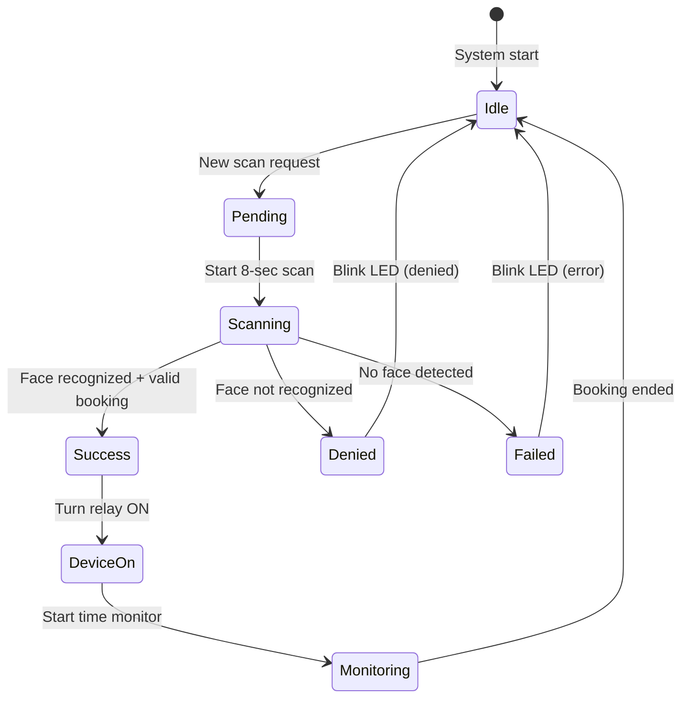

# Raspberry Sync Documentation

## Overview

The Raspberry Pi station runs hardware control and face recognition scanning. It listens to Firestore for scan requests, performs face verification, and controls lab equipment (relays, LEDs) based on booking status.

## Hardware Setup

### Raspberry Pi Configuration

- **Model**: Raspberry Pi 4 (or Raspberry Pi 3B+)
- **OS**: Raspberry Pi OS
- **Camera**: USB Webcam (Logitech C920)
- **Power**: 5V 3A power supply

### GPIO Pin Configuration

| GPIO Pin | Function | Device | Notes |
|----------|----------|--------|-------|
| 26 | Input | Scan Button | Active low (pull-up) |
| 18 | Output | LED (dev01) | Status indicator |
| 23 | Output | LED (dev02) | Status indicator |
| 24 | Output | LED (dev03) | Status indicator |
| 17 | Output | Relay (dev01) | Ender 3 power |
| 27 | Output | Relay (dev02) | Microscope power |
| 22 | Output | Relay (dev03) | Soldering station power |

### Device Configuration

```python
# From raspberry-sync/hardware_gpio.py

BUTTON_PIN = 26

DEVICE_CONFIG = {
    "dev01": {
        "relay": 17,
        "led": 18,
        "name": "Máy in 3D Ender 3"
    },
    "dev02": {
        "relay": 27,
        "led": 23,
        "name": "Kính hiển vi"
    },
    "dev03": {
        "relay": 22,
        "led": 24,
        "name": "Trạm hàn"
    },
}
```

## Project Structure

```
raspberry-sync/
├── main.py                  # Face scanning logic
├── scan_listener.py        # Firestore listener + device control
├── hardware_gpio.py        # GPIO control
├── firebase_service.py     # Firestore operations
├── camera_debug.py         # Camera debugging
├── requirements.txt
├── weights/
│   ├── last_checkpoint.pth # MobileFaceNet model
│   └── face_db.npy          # Face embeddings
└── serviceAccountKey.json   # Firebase credentials
```

## Scripts

### 1. main.py - Face Scanning

**Location**: `raspberry-sync/main.py`

Performs face recognition with voting-based scanning.

```python
# Key functions
def scan_face_once():
    """Scan face for 8 seconds with voting"""
    load_face_database()

    cap = cv2.VideoCapture(0)
    start_time = time.time()

    vote_count = {}
    score_sum = {}

    while time.time() - start_time < SCAN_SECONDS:
        ret, frame = cap.read()
        name, score = recognize(frame)

        if name != "Unknown" and name != "No Face":
            vote_count[name] = vote_count.get(name, 0) + 1
            score_sum[name] = score_sum.get(name, 0) + score

    cap.release()

    # Determine winner by vote count
    final_user_id = max(vote_count, key=vote_count.get)
    final_count = vote_count[final_user_id]
    avg_score = score_sum[final_user_id] / final_count

    return {
        "success": True,
        "userId": final_user_id,
        "score": avg_score,
    }
```

**Configuration**:

```python
SCAN_SECONDS = 8       # Scan duration
THRESHOLD = 0.05       # Cosine similarity threshold
```

**Usage**:

```bash
python main.py
```

### 2. scan_listener.py - Firestore Listener

**Location**: `raspberry-sync/scan_listener.py`

Real-time Firestore listener that handles scan requests.

```python
def on_snapshot(col_snapshot, changes, read_time):
    """Handle Firestore snapshot changes"""
    for change in changes:
        doc = change.document
        data = doc.to_dict()

        if change.type.name not in ["ADDED", "MODIFIED"]:
            continue

        if data.get("deviceId") != DEVICE_ID:
            continue

        if data.get("status") != "pending":
            continue

        handle_scan_request(doc.id, data)
```

**Key Functions**:

```python
def handle_scan_request(doc_id, data):
    """Process scan request

    Supports multi-device activation - a single face scan can activate
    all devices that the user has valid bookings for.
    """
    request_user_id = data.get("userId")
    device_id = data.get("deviceId")
    is_hardware_button = doc_id == "hardware-button"

    # 1. Perform face scan
    scan_result = scan_face_once()

    if not scan_result["success"]:
        blink_led(device_id)
        return

    recognized_user_id = scan_result["userId"]
    score = scan_result["score"]

    # 2. Check if face matches request user (if specified)
    if request_user_id is not None and recognized_user_id != request_user_id:
        blink_led(device_id)
        return

    # 3. Check all valid bookings for this user across all devices
    valid_bookings = check_all_valid_bookings(
        recognized_user_id,
        check_time=True
    )

    if not valid_bookings:
        blink_led(device_id)
        return

    # 4. Activate all valid devices
    for booking_id, booking_data in valid_bookings:
        device_id = booking_data.get("deviceId")
        end_time = booking_data.get("endTime")

        update_device_in_use(device_id, recognized_user_id)
        update_booking_status(booking_id, "using")

        # Start monitoring thread
        monitor_device_until_end(device_id, booking_id, end_time)
```

**Hardware Button Support**:

```python
# Button pin changed to GPIO 26
BUTTON_PIN = 26

# Button debounce: 2 second cooldown
last_press = 0

while True:
    if is_button_pressed():
        now = time.time()
        if now - last_press > 2:
            handle_scan_request("hardware-button", {
                "userId": None,
                "deviceId": SUPPORTED_DEVICES[0]
            })
            last_press = now
    time.sleep(0.1)
```

**Usage**:

```bash
python scan_listener.py
```

### 3. hardware_gpio.py - GPIO Control

**Location**: `raspberry-sync/hardware_gpio.py`

Hardware control functions using RPi.GPIO.

```python
# Initialize GPIO
GPIO.setmode(GPIO.BCM)
GPIO.setwarnings(False)

def is_button_pressed():
    """Check if scan button is pressed"""
    return GPIO.input(BUTTON_PIN) == GPIO.LOW

def relay_on(device_id):
    """Turn on device relay and LED"""
    cfg = DEVICE_CONFIG[device_id]
    GPIO.output(cfg["relay"], GPIO.HIGH)
    GPIO.output(cfg["led"], GPIO.HIGH)

def relay_off(device_id):
    """Turn off device relay and LED"""
    cfg = DEVICE_CONFIG[device_id]
    GPIO.output(cfg["relay"], GPIO.LOW)
    GPIO.output(cfg["led"], GPIO.LOW)

def blink_led(device_id, times=5, delay=0.2):
    """Blink LED for denied/failed access"""
    cfg = DEVICE_CONFIG[device_id]
    for _ in range(times):
        GPIO.output(cfg["led"], GPIO.HIGH)
        time.sleep(delay)
        GPIO.output(cfg["led"], GPIO.LOW)
        time.sleep(delay)

def cleanup_gpio():
    """Clean up GPIO on exit"""
    GPIO.cleanup()
```

### 4. firebase_service.py - Firestore Operations

**Location**: `raspberry-sync/firebase_service.py`

Firestore operations for the Raspberry Pi.

```python
def check_valid_booking(user_id, device_id, check_time=False):
    """Check if user has valid booking for specific device"""
    bookings_ref = db.collection("bookings")

    query = (
        bookings_ref
        .where("userId", "==", user_id)
        .where("deviceId", "==", device_id)
        .where("status", "==", "approved")
        .stream()
    )

    now = datetime.now(timezone.utc)

    for doc in query:
        data = doc.to_dict()
        start_time = data.get("startTime")
        end_time = data.get("endTime")

        if not check_time:
            return doc.id, data

        if start_time and end_time and start_time <= now <= end_time:
            return doc.id, data

    return None, None


def check_all_valid_bookings(user_id, check_time=False):
    """Check all valid bookings for a user across all devices.

    This function enables a single face scan to activate multiple devices
    that the user has valid bookings for.

    Returns:
        List of (booking_id, booking_data) tuples
    """
    bookings_ref = db.collection("bookings")

    query = (
        bookings_ref
        .where("userId", "==", user_id)
        .where("status", "==", "approved")
        .stream()
    )

    now = datetime.now(timezone.utc)
    valid_bookings = []

    for doc in query:
        data = doc.to_dict()

        if not check_time:
            valid_bookings.append((doc.id, data))
            continue

        start_time = data.get("startTime")
        end_time = data.get("endTime")

        if start_time and end_time and start_time <= now <= end_time:
            valid_bookings.append((doc.id, data))

    return valid_bookings


def update_device_in_use(device_id, user_id):
    """Update device status to in_use"""
    db.collection("devices").document(device_id).update({
        "status": "in_use",
        "currentUserId": user_id,
        "updatedAt": firestore.SERVER_TIMESTAMP
    })

def finish_booking_and_release_device(booking_id, device_id):
    """Mark booking as finished and reset device"""
    db.collection("bookings").document(booking_id).update({
        "status": "finished",
        "finishedAt": firestore.SERVER_TIMESTAMP,
        "updatedAt": firestore.SERVER_TIMESTAMP,
    })
    db.collection("devices").document(device_id).update({
        "status": "ready",
        "currentUserId": None,
        "currentUserName": None,
        "updatedAt": firestore.SERVER_TIMESTAMP
    })
```

## State Machine



## Face Recognition

### Recognition Algorithm

The Raspberry Pi uses the same MobileFaceNet model as the AI server but with different parameters:

```python
# From raspberry-sync/main.py

THRESHOLD = 0.05  # Much lower threshold than local inference

def recognize(frame):
    """Recognize face from frame"""
    embedding = get_embedding(frame)

    if embedding is None:
        return "No Face", None

    best_score = -1
    best_name = "Unknown"

    for name, db_embs in db_tensor.items():
        emb_expand = embedding.expand_as(db_embs)
        scores = F.cosine_similarity(emb_expand, db_embs)
        max_score = torch.max(scores).item()

        if max_score > best_score:
            best_score = max_score
            best_name = name

    if best_score < THRESHOLD:
        return "Unknown", best_score

    return best_name, best_score
```

### Voting System

During the 8-second scan period:

1. Frame captured every ~200ms (approximately 40 frames)
2. Each frame produces a recognition result
3. Vote count tracks matches per user
4. User with most votes wins
5. Average score calculated for winning user

## Monitoring Thread

```python
def monitor_device_until_end(device_id, booking_id, end_time):
    """Monitor device until booking end time"""
    relay_on(device_id)

    while True:
        now = datetime.now(timezone.utc)

        if now >= end_time:
            relay_off(device_id)
            finish_booking_and_release_device(booking_id, device_id)
            break

        time.sleep(1)
```

## Firestore scanRequests Collection

```json
{
  "document_id": {
    "userId": "user_uid",
    "deviceId": "dev01",
    "status": "pending|scanning|success|denied|failed|error",
    "recognizedUserId": "recognized_user_id",
    "score": 0.85,
    "bookingId": "booking_id",
    "message": "Xác thực thành công",
    "createdAt": timestamp,
    "updatedAt": timestamp
  }
}
```

## Dependencies

```
torch
opencv-python
numpy
firebase-admin
RPi.GPIO
```

See `raspberry-sync/requirements.txt` for exact versions.

## Startup

### Automatic Startup (systemd)

Create a systemd service for automatic startup:

```ini
# /etc/systemd/system/raspberry-sync.service
[Unit]
Description=PBL5 Raspberry Sync Service

[Service]
Type=simple
User=pi
WorkingDirectory=/home/pi/Desktop/PBL5_HARDWARE
ExecStart=/usr/bin/python3 scan_listener.py
Restart=always

[Install]
WantedBy=multi-user.target
```

Enable the service:

```bash
sudo systemctl enable raspberry-sync.service
sudo systemctl start raspberry-sync.service
```

## Security

1. **Local Network Only**: Raspberry Pi accessible only within lab network (172.20.10.0/24)
2. **SSH Disabled**: Password SSH disabled, key-based only
3. **Face Data**: Only embeddings stored, not raw images
4. **Button Debounce**: 2-second cooldown between button presses

## Error Handling

| State | Cause | LED Behavior | Action |
|-------|-------|------------|-------|
| failed | No face detected | Blink 5x | Retry scan |
| denied | No valid booking | Blink 5x | Contact admin |
| error | System error | Blink 5x | Check logs |

## Logging

The system logs to stdout with timestamps:

```
[INFO] Loading model...
[INFO] Loading face detector...
[READY] Camera running...
[INFO] Quét mặt trong 8 giây...
[VOTE] user_id | score=0.1234 | count=1
[SUCCESS] Người được nhận diện nhiều nhất: user_id
[AUTHORIZED] Xác thực thành công
[GPIO] ON dev01 - Máy in 3D Ender 3
```