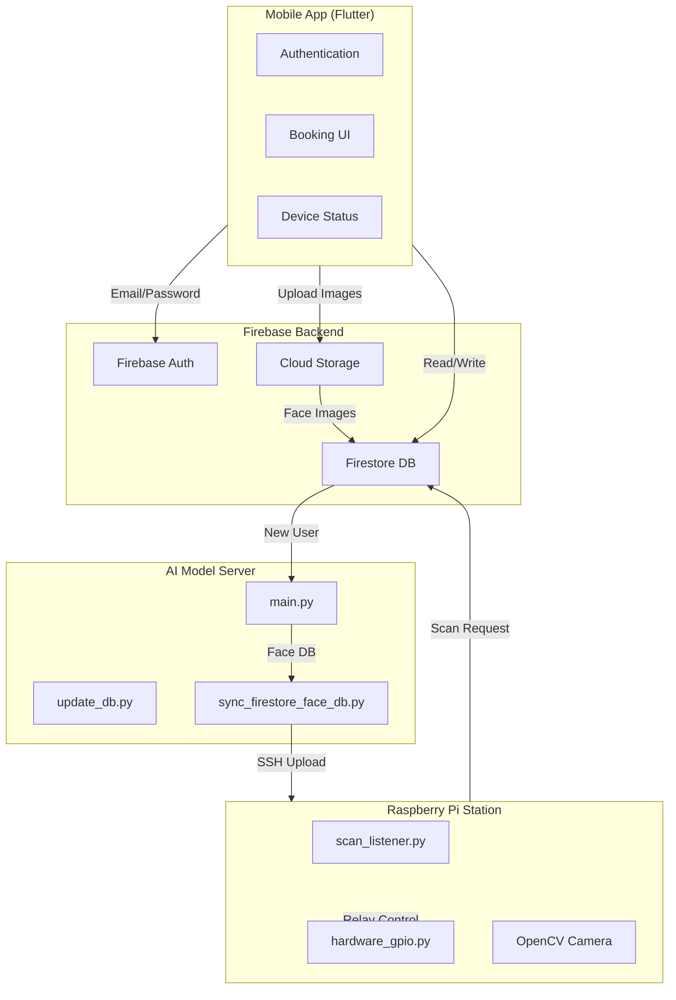
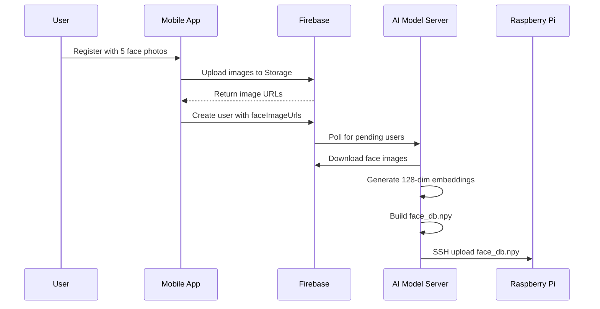
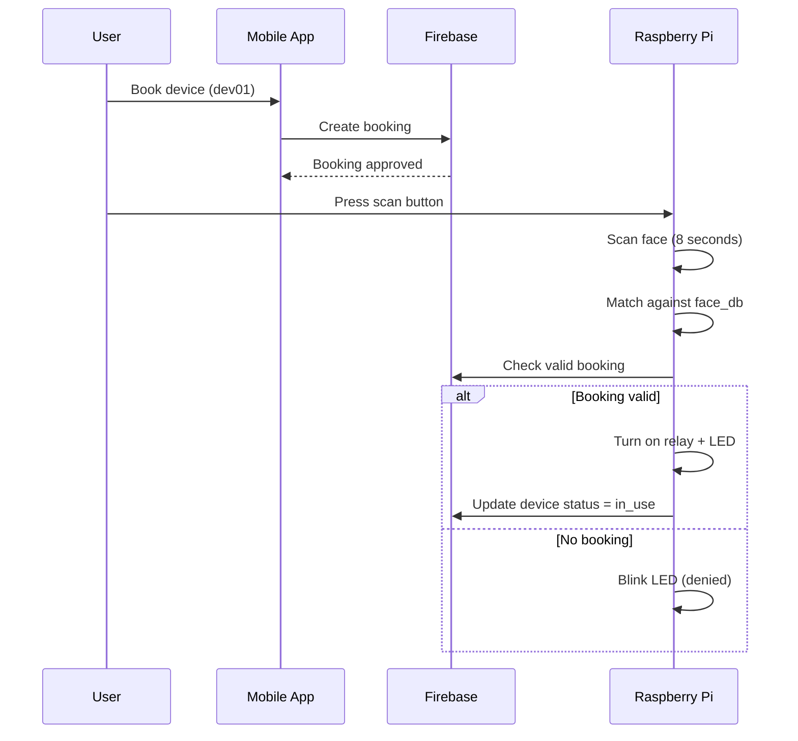
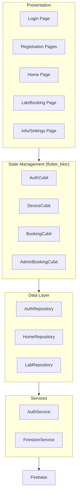
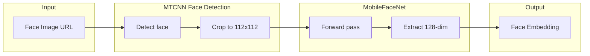
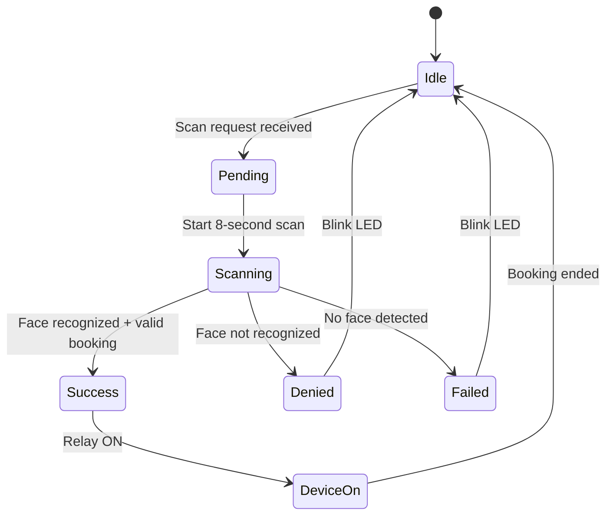
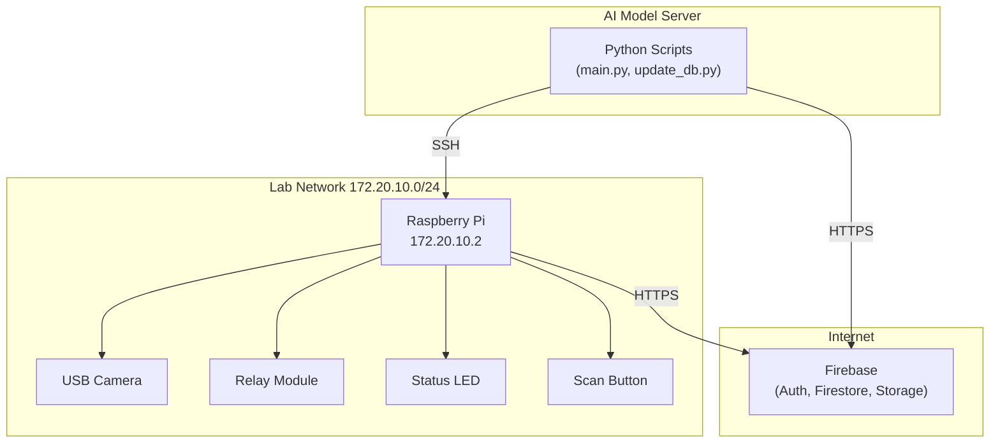
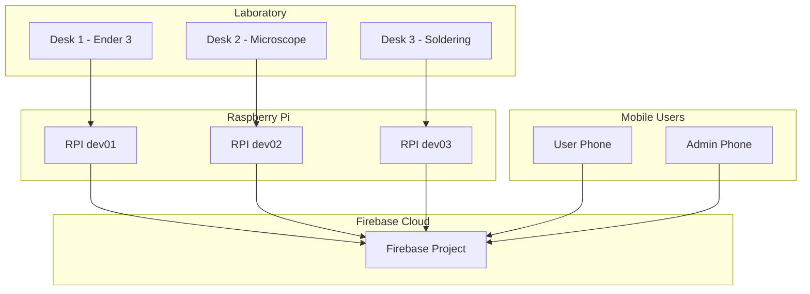

# System Architecture

## Overview

The PBL5 Lab Manager system consists of three main components that communicate through Firebase as the central data store:

1. **Mobile App** - Flutter-based client for user authentication, booking, and device monitoring
2. **AI Model Server** - PyTorch-based face recognition model for embedding generation
3. **Raspberry Pi Station** - Hardware controller with face scanning capability

## High-Level Architecture

## Data Flow Diagram

### User Registration Flow

### Device Access Flow

## Component Architecture

### Mobile App Architecture

### AI Model Pipeline

### Raspberry Pi State Machine

## Network Architecture

## Security Considerations

1. **Face Data**: Stored as 128-dimensional embeddings, not raw images
2. **SSH Access**: Raspberry Pi accessible only within local network
3. **Firebase Rules**: Role-based access control in Firestore security rules
4. **Booking Validation**: Time-based validation prevents unauthorized access

## Hardware Pin Configuration

| GPIO Pin | Function | Device |
|---------|----------|--------|
| 17 | Input | Scan Button |
| 22 | Output | LED (dev01) |
| 23 | Output | LED (dev02) |
| 24 | Output | LED (dev03) |
| 27 | Output | Relay (dev01) |
| 5 | Output | Relay (dev02) |
| 6 | Output | Relay (dev03) |

## Component Communication

| From | To | Protocol | Data |
|------|-------|---------|------|
| Mobile App | Firebase | REST API | User, Booking, Device data |
| AI Model | Firebase | REST API | User embeddings |
| AI Model | Raspberry | SFTP (SSH) | face_db.npy |
| Raspberry | Firebase | Firestore SDK | Scan requests, device status |
| Raspberry | Hardware | GPIO | Relay, LED control |

## Deployment Topology

