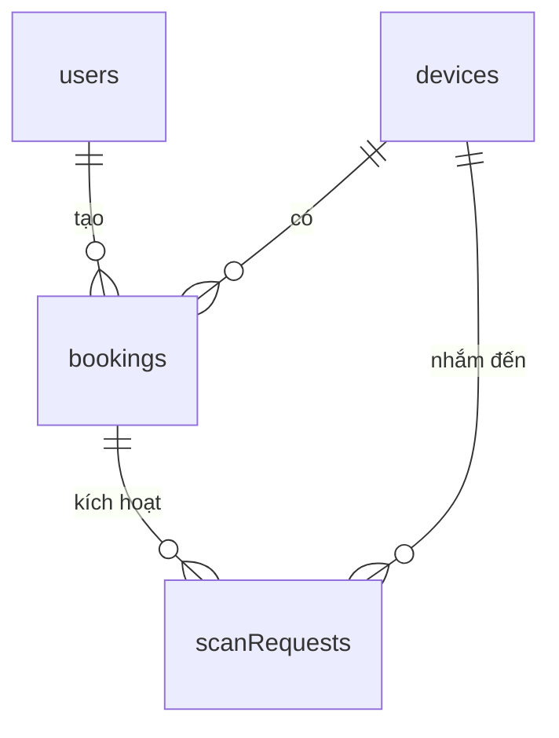

# Lược đồ Cơ sở Dữ liệu

## Tổng quan

PBL5 Lab Manager sử dụng Firebase Cloud Firestore làm cơ sở dữ liệu chính. Cơ sở dữ liệu lưu trữ người dùng, thiết bị, đặt chỗ và yêu cầu quét.

## Các Collection

| Collection | Mục đích |
|-----------|---------|
| users | Hồ sơ người dùng và dữ liệu khuôn mặt |
| devices | Trạng thái thiết bị phòng lab |
| bookings | Đặt chỗ thiết bị |
| scanRequests | Yêu cầu quét khuôn mặt |

## users Collection

### Cấu trúc Document

```
users/{uid}
```

| Trường | Loại | Mô tả |
|-------|------|-------------|
| name | string | Họ tên đầy đủ |
| email | string | Email người dùng |
| role | string | "user" hoặc "admin" |
| num | string | Số sinh viên/nhân viên |
| job | string | Chức vụ/vai trò |
| birthday | string | Ngày sinh (DD/MM/YYYY) |
| faceImageUrls | array | Danh sách URL ảnh khuôn mặt |
| embeddingStatus | string | "pending", "processing", "done", "failed" |
| embeddingUpdatedAt | timestamp | Cập nhật embedding cuối cùng |
| embeddingCount | number | Số embedding thành công |
| embeddingError | string | Thông báo lỗi nếu thất bại |
| createdAt | timestamp | Thời gian tạo tài khoản |
| updatedAt | timestamp | Cập nhật cuối cùng |

### Document Mẫu

```json
{
  "uid": "VAwQ9sogfLTbE4fAUkiEbAQAUeh1",
  "name": "John Doe",
  "email": "john@example.com",
  "role": "user",
  "num": "SV123456",
  "job": "Student",
  "birthday": "01/01/2000",
  "faceImageUrls": [
    "https://firebasestorage.googleapis.com/v0/b/.../face_0.jpg",
    "https://firebasestorage.googleapis.com/v0/b/.../face_1.jpg",
    "https://firebasestorage.googleapis.com/v0/b/.../face_2.jpg",
    "https://firebasestorage.googleapis.com/v0/b/.../face_3.jpg",
    "https://firebasestorage.googleapis.com/v0/b/.../face_4.jpg"
  ],
  "embeddingStatus": "done",
  "embeddingUpdatedAt": "2024-01-15T10:30:00Z",
  "embeddingCount": 5,
  "embeddingError": null,
  "createdAt": "2024-01-10T08:00:00Z",
  "updatedAt": "2024-01-15T10:30:00Z"
}
```

## devices Collection

### Cấu trúc Document

```
devices/{deviceId}
```

| Trường | Loại | Mô tả |
|-------|------|-------------|
| name | string | Tên thiết bị |
| status | string | "ready", "in_use", "maintenance" |
| currentUserId | string? | UID người dùng đang dùng thiết bị |
| currentUserName | string? | Tên người dùng hiện tại |
| description | string | Mô tả thiết bị |
| location | string | Vị trí thiết bị |
| updatedAt | timestamp | Cập nhật trạng thái cuối cùng |

### Document Mẫu

```json
{
  "deviceId": "dev01",
  "name": "Máy in 3D Ender 3",
  "status": "ready",
  "currentUserId": null,
  "currentUserName": null,
  "description": "Ender 3 Pro 3D Printer",
  "location": "Lab bench 1",
  "updatedAt": "2024-01-15T10:00:00Z"
}
```

```json
{
  "deviceId": "dev02",
  "name": "Kính hiển vi",
  "status": "in_use",
  "currentUserId": "VAwQ9sogfLTbE4fAUkiEbAQAUeh1",
  "currentUserName": "John Doe",
  "description": "Olympus CX23 Microscope",
  "location": "Lab bench 2",
  "updatedAt": "2024-01-15T11:30:00Z"
}
```

## bookings Collection

### Cấu trúc Document

```
bookings/{bookingId}
```

| Trường | Loại | Mô tả |
|-------|------|-------------|
| userId | string | UID người dùng |
| userName | string | Tên người dùng |
| deviceId | string | ID thiết bị |
| deviceName | string | Tên thiết bị |
| startTime | timestamp | Thời gian bắt đầu đặt chỗ (UTC) |
| endTime | timestamp | Thời gian kết thúc đặt chỗ (UTC) |
| status | string | "pending", "approved", "using", "finished", "cancelled" |
| createdAt | timestamp | Thời gian tạo đặt chỗ |
| updatedAt | timestamp | Cập nhật cuối cùng |
| approvedAt | timestamp | Thời gian phê duyệt |
| finishedAt | timestamp | Thời gian hoàn thành |

### Luồng Trạng thái Đặt chỗ

```
pending -> approved -> using -> finished
              |
              v
           cancelled
```

### Document Mẫu

```json
{
  "bookingId": "bk001",
  "userId": "VAwQ9sogfLTbE4fAUkiEbAQAUeh1",
  "userName": "John Doe",
  "deviceId": "dev01",
  "deviceName": "Máy in 3D Ender 3",
  "startTime": "2024-01-15T14:00:00Z",
  "endTime": "2024-01-15T16:00:00Z",
  "status": "approved",
  "createdAt": "2024-01-14T10:00:00Z",
  "updatedAt": "2024-01-14T12:00:00Z",
  "approvedAt": "2024-01-14T12:00:00Z",
  "finishedAt": null
}
```

## scanRequests Collection

### Cấu trúc Document

```
scanRequests/{requestId}
```

| Trường | Loại | Mô tả |
|-------|------|-------------|
| userId | string | UID người dùng yêu cầu quét (có thể null cho nút phần cứng) |
| deviceId | string | ID thiết bị |
| status | string | "pending", "scanning", "success", "denied", "failed", "error" |
| recognizedUserId | string? | UID người dùng được nhận dạng |
| score | number? | Điểm nhận dạng |
| bookingId | string? | ID đặt chỗ liên quan |
| message | string | Thông báo trạng thái |
| createdAt | timestamp | Thời gian tạo yêu cầu |
| updatedAt | timestamp | Cập nhật cuối cùng |

### Giá trị Trạng thái

| Trạng thái | Mô tả |
|-----------|-------------|
| pending | Đang chờ quét |
| scanning | Đang quét |
| success | Truy cập được cấp |
| denied | Truy cập bị từ chối |
| failed | Quét thất bại |
| error | Có lỗi xảy ra |

### Document Mẫu

```json
{
  "requestId": "sr001",
  "userId": "VAwQ9sogfLTbE4fAUkiEbAQAUeh1",
  "deviceId": "dev01",
  "status": "success",
  "recognizedUserId": "VAwQ9sogfLTbE4fAUkiEbAQAUeh1",
  "score": 0.85,
  "bookingId": "bk001",
  "message": "Xác thực thành công, thiết bị đã được mở",
  "createdAt": "2024-01-15T14:05:00Z",
  "updatedAt": "2024-01-15T14:05:15Z"
}
```

## Quan hệ



### Người dùng -> Đặt chỗ

Một người dùng có thể có nhiều đặt chỗ:

```
users/{uid} -> bookings (qua trường userId)
```

### Thiết bị -> Đặt chỗ

Một thiết bị có thể có nhiều đặt chỗ:

```
devices/{deviceId} -> bookings (qua trường deviceId)
```

### Thiết bị -> Yêu cầu Quét

Một thiết bị có thể có nhiều yêu cầu quét:

```
devices/{deviceId} -> scanRequests (qua trường deviceId)
```

## Indexes

Các index Firestore sau được yêu cầu:

| Collection | Query | Trường |
|-----------|-------|--------|
| bookings | Đặt chỗ người dùng | userId, status |
| bookings | Đặt chỗ thiết bị | deviceId, status |
| bookings | Đặt chỗ đang hoạt động | deviceId, status, startTime |
| scanRequests | Yêu cầu chờ | deviceId, status |

## Quy tắc Bảo mật

```javascript
rules_version = '2';
service cloud.firestore {
  match /databases/{database}/documents {
    // Người dùng có thể đọc hồ sơ của chính họ
    match /users/{userId} {
      allow read: if request.auth != null && request.auth.uid == userId;
      allow write: if request.auth != null && request.auth.uid == userId;
    }

    // Quản trị viên có thể đọc tất cả người dùng
    match /users/{userId} {
      allow read: if request.auth != null &&
        get(/databases/$(database)/documents/users/$(request.auth.uid)).data.role == 'admin';
    }

    // Người dùng đã xác thực có thể đọc thiết bị
    match /devices/{deviceId} {
      allow read: if request.auth != null;
    }

    // Quản trị viên có thể ghi thiết bị
    match /devices/{deviceId} {
      allow write: if request.auth != null &&
        get(/databases/$(database)/documents/users/$(request.auth.uid)).data.role == 'admin';
    }

    // Người dùng có thể tạo đặt chỗ
    match /bookings/{bookingId} {
      allow create: if request.auth != null &&
        request.resource.data.userId == request.auth.uid;
      allow read: if request.auth != null;
      allow update: if request.auth != null;
    }

    // Quản trị viên có thể quản lý tất cả đặt chỗ
    match /bookings/{bookingId} {
      allow delete: if request.auth != null &&
        get(/databases/$(database)/documents/users/$(request.auth.uid)).data.role == 'admin';
    }

    // Tài khoản service Raspberry Pi có thể ghi scanRequests
    match /scanRequests/{requestId} {
      allow read, write: if request.auth.token.email == 'raspberry@pbl5-lab.firebaseadmin.com';
    }
  }
}
```

## Di chuyển Dữ liệu

### Thêm trường embedding vào users

```javascript
// Script di chuyển Firestore
const db = admin.firestore();

async function migrate() {
  const snapshot = await db.collection('users').get();

  snapshot.forEach(async (doc) => {
    const data = doc.data();
    if (!data.embeddingStatus) {
      await doc.ref.update({
        embeddingStatus: 'pending',
        embeddingCount: 0,
        embeddingError: null
      });
    }
  });
}
```

## Sao lưu

### Export Firestore

```bash
gcloud firestore export gs://pbl5-lab-backup/$(date +%Y%m%d)
```

### Import Firestore

```bash
gcloud firestore import gs://pbl5-lab-backup/20240115
```

## Giám sát

### Sử dụng Firestore

Xem sử dụng Firestore trong Firebase Console:
- Firebase Console -> Firestore -> Usage

### Các Chỉ số Chính

| Chỉ số | Mô tả |
|--------|-------|
| Document reads | Số lần đọc document |
| Document writes | Số lần ghi document |
| Document deletes | Số lần xóa document |
| Storage | Tổng storage sử dụng |