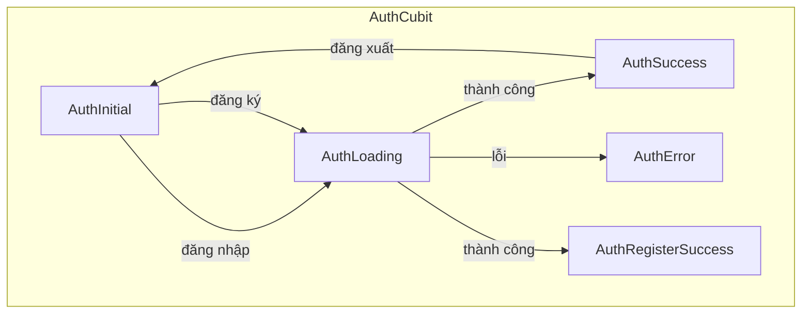
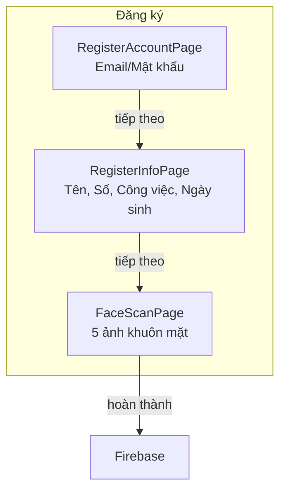
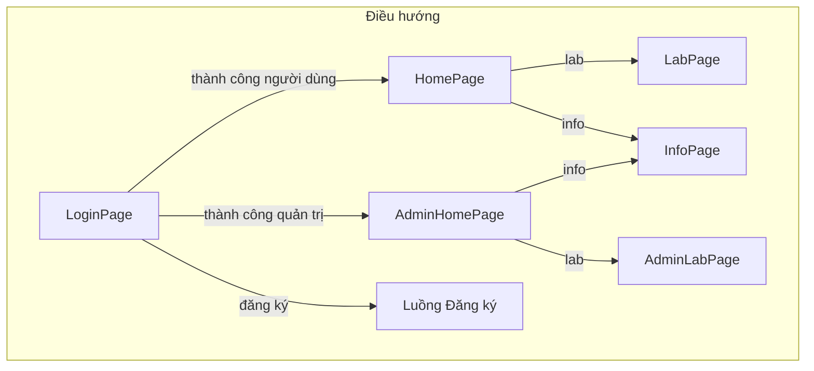

# Tài liệu Ứng dụng Di động

## Tổng quan

Ứng dụng di động PBL5 Lab Manager được xây dựng bằng Flutter sử dụng mẫu BLoC (flutter_bloc) để quản lý trạng thái. Nó cung cấp xác thực người dùng, đặt thiết bị và các tính năng quản trị.

## Kiến trúc

### Công nghệ sử dụng

- **Framework**: Flutter 3.0+
- **Quản lý Trạng thái**: flutter_bloc (mẫu Cubit)
- **Phụ trợ**: Firebase (Auth, Firestore, Storage)
- **Phát hiện Khuôn mặt**: google_mlkit_face_detection

### Cấu trúc Dự án

```
mobile_app/
├── lib/
│   ├── main.dart                    # Điểm vào ứng dụng
│   ├── core/
│   │   ├── models/                  # Mô hình dữ liệu
│   │   │   ├── user_model.dart
│   │   │   ├── device_model.dart
│   │   │   └── booking_model.dart
│   │   ├── services/
│   │   │   ├── auth_service.dart     # Xác thực Firebase
│   │   │   └── firestore_service.dart  # Hoạt động Firestore
│   │   ├── theme/
│   │   │   └── app_theme.dart
│   │   └── utils/
│   │       └── image_converter.dart
│   └── modules/
│       ├── auth/
│       │   ├── presentation/
│       │   │   ├── application/
│       │   │   │   └── cubit/
│       │   │   │       ├── auth_cubit.dart
│       │   │   │       └── auth_state.dart
│       │   │   └── components/
│       │   │       ├── login_page.dart
│       │   │       ├── register_account_page.dart
│       │   │       ├── register_info_page.dart
│       │   │       └── face_scan_page.dart
│       │   └── repository/
│       │       └── auth_repository.dart
│       ├── home/
│       │   ├── presentation/
│       │   │   ├── application/
│       │   │   │   └── cubit/
│       │   │   │       ├── device_cubit.dart
│       │   │   │       └── device_state.dart
│       │   │   └── components/
│       │   │       ├── home_page.dart
│       │   │       └── admin_home_page.dart
│       │   └── repository/
│       │       └── home_repository.dart
│       ├── lab/
│       │   ├── presentation/
│       │   │   ├── application/
│       │   │   │   └── cubit/
│       │   │   │       ├── booking_cubit.dart
│       │   │   │       ├── booking_state.dart
│       │   │   │       ├── admin_booking_cubit.dart
│       │   │   │       └── admin_booking_state.dart
│       │   │   └── components/
│       │   │       ├── lab_page.dart
│       │   │       ├── admin_lab_page.dart
│       │   │       ├── device_bookings_page.dart
│       │   │       └── date_time_picker.dart
│       │   └── repository/
│       │       └── lab_repository.dart
│       ├── info/
│       │   └── presentation/
│       │       └── components/
│       │           ├── info_page.dart
│       │           └── settings_page.dart
│       └── common/
│           └── presentation/
│               └── components/
│                   └── main_screen.dart
```

## Quản lý Trạng thái

### Cubits

| Cubit | Mục đích | Trạng thái Chính |
|-------|---------|------------|
| AuthCubit | Xác thực | AuthInitial, AuthLoading, AuthSuccess, AuthRegisterSuccess, AuthError |
| DeviceCubit | Theo dõi thiết bị | DeviceInitial, DeviceLoading, DeviceLoaded, DeviceError |
| BookingCubit | Đặt chỗ của người dùng | BookingInitial, BookingLoading, BookingLoaded, BookingError |
| AdminBookingCubit | Quản lý đặt chỗ quản trị | AdminBookingInitial, AdminBookingLoading, AdminBookingLoaded |

### Luồng Trạng thái



## Luồng Xác thực

### Đăng ký 3 Bước



### Các Trang Đăng ký

#### 1. LoginPage (`login_page.dart`)

- Trường nhập email
- Trường nhập mật khẩu
- Nút đăng nhập
- Liên kết "Đăng ký" đến luồng đăng ký

```dart
// Từ login_page.dart
ElevatedButton(
  onPressed: () {
    context.read<AuthCubit>().login(email, password);
  },
  child: Text("Đăng nhập"),
)
```

#### 2. RegisterAccountPage (`register_account_page.dart`)

- Nhập email
- Nhập mật khẩu
- Xác nhận mật khẩu

#### 3. RegisterInfoPage (`register_info_page.dart`)

- Nhập tên
- Số sinh viên/nhân viên
- Công việc/vai trò
- Ngày sinh

#### 4. FaceScanPage (`face_scan_page.dart`)

- Chụp 5 ảnh khuôn mặt sử dụng camera thiết bị
- Sử dụng google_mlkit_face_detection để phát hiện khuôn mặt
- Tải lên Firebase Storage
- Tạo người dùng với faceImageUrls

```dart
// Từ face_scan_page.dart
// Chụp 5 ảnh
for (int i = 0; i < 5; i++) {
  String url = await _authRepository.uploadFile(imageFiles[i]);
  imageUrls.add(url);
}
```

### Mô hình Người dùng

```dart
// Từ core/models/user_model.dart
class UserModel {
  final String uid;
  final String name;
  final String email;
  final String role;          // "user" hoặc "admin"
  final List<String> faceImageUrls;
  final String num;           // Số sinh viên/nhân viên
  final String birthday;
  final String job;
}
```

## Giao diện Dựa trên Vai trò

### Vai trò Người dùng (role: "user")

| Trang | Mô tả |
|------|-------------|
| HomePage | Tổng quan trạng thái thiết bị |
| LabPage | Đặt thiết bị |
| InfoPage | Hồ sơ và cài đặt |

### Vai trò Quản trị (role: "admin")

| Trang | Mô tả |
|------|-------------|
| AdminHomePage | Trạng thái + quản lý tất cả thiết bị |
| AdminLabPage | Tất cả đặt chỗ + phê duyệt |
| InfoPage | Hồ sơ và cài đặt |

## Các Trang

### HomePage / AdminHomePage

Hiển thị trạng thái thiết bị và thao tác nhanh.

```dart
// Từ home_page.dart / admin_home_page.dart
ListView.builder(
  itemCount: devices.length,
  itemBuilder: (context, index) {
    return Card(
      child: ListTile(
        title: Text(devices[index].name),
        subtitle: Text(devices[index].status),
        trailing: _buildStatusIndicator(devices[index].status),
      ),
    );
  },
)
```

### LabPage / AdminLabPage

Giao diện đặt thiết bị.

```dart
// Từ lab_page.dart
// Luồng người dùng: Chọn thiết bị -> Chọn ngày/giờ -> Gửi đặt chỗ
Future<void> _createBooking(Device device, DateTime start, DateTime end) async {
  await context.read<BookingCubit>().createBooking(
    deviceId: device.id,
    startTime: start,
    endTime: end,
  );
}
```

### InfoPage / SettingsPage

Hồ sơ và cài đặt người dùng.

```dart
// Từ info_page.dart
Column(
  children: [
    CircleAvatar(radius: 50, backgroundImage: NetworkImage(user.avatarUrl)),
    Text(user.name),
    Text(user.email),
    Text(user.role),
  ],
)
```

## Các Dịch vụ

### AuthService

```dart
// Từ core/services/auth_service.dart
class AuthService {
  Future<UserCredential> signInWithEmailAndPassword(String email, String password);
  Future<UserCredential> createUserWithEmailAndPassword(String email, String password);
  Future<User> getCurrentUser();
  Future<void> signOut();
  Future<String> uploadFile(File file);
}
```

### FirestoreService

```dart
// Từ core/services/firestore_service.dart
class FirestoreService {
  // Hoạt động người dùng
  Future<void> createUser(UserModel user);
  Future<UserModel?> getUser(String uid);

  // Hoạt động thiết bị
  Future<List<DeviceModel>> getDevices();
  Stream<List<DeviceModel>> watchDevices();

  // Hoạt động đặt chỗ
  Future<String> createBooking(BookingModel booking);
  Future<List<BookingModel>> getBookings(String userId);
  Stream<List<BookingModel>> watchBookings();
  Future<void> updateBookingStatus(String bookingId, String status);
}
```

## Các Repository

### AuthRepository

```dart
// Từ modules/auth/repository/auth_repository.dart
class AuthRepository {
  final AuthService _authService;

  Future<UserModel> signIn(String email, String password);
  Future<void> signUp({
    required String email,
    required String password,
    required String name,
    required List<String> faceImageUrls,
  });
  Future<void> signOut();
  Future<String> uploadFile(File file);
}
```

### HomeRepository

```dart
// Từ modules/home/repository/home_repository.dart
class HomeRepository {
  final FirestoreService _firestoreService;

  Stream<List<DeviceModel>> watchDevices();
}
```

### LabRepository

```dart
// Từ modules/lab/repository/lab_repository.dart
class LabRepository {
  final FirestoreService _firestoreService;

  Future<String> createBooking(BookingModel booking);
  Stream<List<BookingModel>> watchBookings();
  Future<void> updateBookingStatus(String bookingId, String status);
}
```

## Các Mô hình Dữ liệu

### UserModel

```dart
// Từ core/models/user_model.dart
class UserModel {
  final String uid;
  final String name;
  final String email;
  final String role;              // "user" hoặc "admin"
  final List<String> faceImageUrls;
  final String num;             // Số sinh viên
  final String birthday;
  final String job;
}
```

### DeviceModel

```dart
// Từ core/models/device_model.dart
class DeviceModel {
  final String id;               // "dev01", "dev02", "dev03"
  final String name;
  final String status;           // "ready", "in_use", "maintenance"
  final String? currentUserId;
  final String? currentUserName;
  final DateTime? updatedAt;
}
```

### BookingModel

```dart
// Từ core/models/booking_model.dart
class BookingModel {
  final String id;
  final String userId;
  final String deviceId;
  final DateTime startTime;
  final DateTime endTime;
  final String status;           // "pending", "approved", "using", "finished", "cancelled"
  final DateTime createdAt;
}
```

## Luồng Điều hướng



## Phụ thuộc

```yaml
# pubspec.yaml
dependencies:
  flutter:
    sdk: flutter
  firebase_core: ^2.0.0
  firebase_auth: ^4.0.0
  cloud_firestore: ^4.0.0
  firebase_storage: ^11.0.0
  flutter_bloc: ^8.0.0
  equatable: ^2.0.0
  google_mlkit_face_detection: ^0.5.0
  cloudinary_public: ^0.21.0
  intl: ^0.18.0
```

## Giao diện

```dart
// Từ core/theme/app_theme.dart
ThemeData(
  colorScheme: ColorScheme.fromSeed(
    seedColor: Color(0xFF6366F1),  // Indigo
    brightness: Brightness.light,
  ),
  useMaterial3: true,
  cardTheme: CardThemeData(
    elevation: 4,
    shadowColor: Colors.black26,
    shape: RoundedRectangleBorder(
      borderRadius: BorderRadius.all(Radius.circular(16)),
    ),
  ),
)
```

## Xử lý Lỗi

| Trạng thái Lỗi | Nguyên nhân | Khôi phục |
|-------------|-------|----------|
| AuthError | Thông tin xác thực không hợp lệ | Hiển thị thông báo lỗi, thử lại |
| DeviceError | Lỗi đọc Firestore | Thử tải lại |
| BookingError | Xung đột đặt chỗ | Hiển thị thời gian có sẵn |

## Các Collection Firebase

Xem [Tài liệu Cơ sở Dữ liệu](database.md) để biết lược đồ chi tiết.