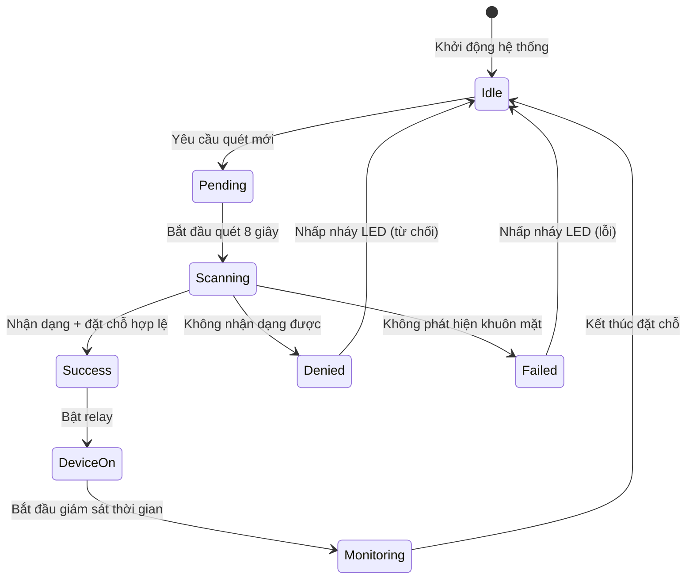

# Tài liệu Raspberry Sync

## Tổng quan

Trạm Raspberry Pi chạy điều khiển phần cứng và quét nhận dạng khuôn mặt. Nó lắng nghe Firestore để nhận yêu cầu quét, thực hiện xác minh khuôn mặt và điều khiển thiết bị phòng lab (relay, LED) dựa trên trạng thái đặt chỗ.

## Thiết lập Phần cứng

### Cấu hình Raspberry Pi

- **Model**: Raspberry Pi 4 (hoặc Raspberry Pi 3B+)
- **OS**: Raspberry Pi OS
- **Camera**: USB Webcam (Logitech C920)
- **Nguồn**: 5V 3A power supply

### Cấu hình Pin GPIO

| Pin GPIO | Chức năng | Thiết bị | Ghi chú |
|----------|----------|--------|-------|
| 17 | Đầu vào | Nút Quét | Active low (pull-up) |
| 22 | Đầu ra | LED (dev01) | Chỉ báo trạng thái |
| 23 | Đầu ra | LED (dev02) | Chỉ báo trạng thái |
| 24 | Đầu ra | LED (dev03) | Chỉ báo trạng thái |
| 27 | Đầu ra | Relay (dev01) | Nguồn Ender 3 |
| 5 | Đầu ra | Relay (dev02) | Nguồn Kính hiển vi |
| 6 | Đầu ra | Relay (dev03) | Nguồn Trạm hàn |

### Cấu hình Thiết bị

```python
# Từ raspberry-sync/hardware_gpio.py

DEVICE_CONFIG = {
    "dev01": {
        "relay": 27,
        "led": 22,
        "name": "Máy in 3D Ender 3"
    },
    "dev02": {
        "relay": 5,
        "led": 23,
        "name": "Kính hiển vi"
    },
    "dev03": {
        "relay": 6,
        "led": 24,
        "name": "Trạm hàn"
    },
}
```

## Cấu trúc Dự án

```
raspberry-sync/
├── main.py                  # Logic quét khuôn mặt
├── scan_listener.py        # Trình nghe Firestore + điều khiển thiết bị
├── hardware_gpio.py        # Điều khiển GPIO
├── firebase_service.py     # Hoạt động Firestore
├── camera_debug.py         # Gỡ lỗi camera
├── requirements.txt
├── weights/
│   ├── last_checkpoint.pth # Mô hình MobileFaceNet
│   └── face_db.npy          # Embedding khuôn mặt
└── serviceAccountKey.json   # Thông tin xác thực Firebase
```

## Scripts

### 1. main.py - Quét Khuôn mặt

**Vị trí**: `raspberry-sync/main.py`

Thực hiện nhận dạng khuôn mặt với quét dựa trên bỏ phiếu.

```python
# Các hàm chính
def scan_face_once():
    """Quét khuôn mặt trong 8 giây với bỏ phiếu"""
    load_face_database()

    cap = cv2.VideoCapture(0)
    start_time = time.time()

    vote_count = {}
    score_sum = {}

    while time.time() - start_time < SCAN_SECONDS:
        ret, frame = cap.read()
        name, score = recognize(frame)

        if name != "Unknown" and name != "No Face":
            vote_count[name] = vote_count.get(name, 0) + 1
            score_sum[name] = score_sum.get(name, 0) + score

    cap.release()

    # Xác định người chiến thắng bằng số phiếu
    final_user_id = max(vote_count, key=vote_count.get)
    final_count = vote_count[final_user_id]
    avg_score = score_sum[final_user_id] / final_count

    return {
        "success": True,
        "userId": final_user_id,
        "score": avg_score,
    }
```

**Cấu hình**:

```python
SCAN_SECONDS = 8       # Thời gian quét
THRESHOLD = 0.05       # Ngưỡng cosine similarity
```

**Cách sử dụng**:

```bash
python main.py
```

### 2. scan_listener.py - Trình nghe Firestore

**Vị trí**: `raspberry-sync/scan_listener.py`

Trình nghe Firestore thời gian thực xử lý yêu cầu quét.

```python
def on_snapshot(col_snapshot, changes, read_time):
    """Xử lý thay đổi snapshot Firestore"""
    for change in changes:
        doc = change.document
        data = doc.to_dict()

        if change.type.name not in ["ADDED", "MODIFIED"]:
            continue

        if data.get("deviceId") != DEVICE_ID:
            continue

        if data.get("status") != "pending":
            continue

        handle_scan_request(doc.id, data)
```

**Các hàm chính**:

```python
def handle_scan_request(doc_id, data):
    """Xử lý yêu cầu quét"""
    request_user_id = data.get("userId")
    device_id = data.get("deviceId")

    # 1. Thực hiện quét khuôn mặt
    scan_result = scan_face_once()

    # 2. Kiểm tra khuôn mặt có khớp với người dùng yêu cầu không
    if request_user_id and recognized_user_id != request_user_id:
        # Khuôn mặt không khớp - từ chối
        blink_led(DEVICE_ID)
        return

    # 3. Kiểm tra đặt chỗ hợp lệ
    booking_id, booking_data = check_valid_booking(
        recognized_user_id,
        DEVICE_ID,
        check_time=True
    )

    if booking_id is None:
        # Không có đặt chỗ hợp lệ - từ chối
        blink_led(DEVICE_ID)
        return

    # 4. Bật relay
    relay_on(DEVICE_ID)

    # 5. Bắt đầu luồng giám sát
    monitor_device_until_end(DEVICE_ID, booking_id, end_time)
```

**Hỗ trợ Nút Phần cứng**:

```python
while True:
    if is_button_pressed():
        handle_scan_request("hardware-button", {
            "userId": None,
            "deviceId": DEVICE_ID
        })
    time.sleep(0.1)
```

**Cách sử dụng**:

```bash
python scan_listener.py
```

### 3. hardware_gpio.py - Điều khiển GPIO

**Vị trí**: `raspberry-sync/hardware_gpio.py`

Các hàm điều khiển phần cứng sử dụng RPi.GPIO.

```python
# Khởi tạo GPIO
GPIO.setmode(GPIO.BCM)
GPIO.setwarnings(False)

def is_button_pressed():
    """Kiểm tra nút quét có được nhấn không"""
    return GPIO.input(BUTTON_PIN) == GPIO.LOW

def relay_on(device_id):
    """Bật relay và LED thiết bị"""
    cfg = DEVICE_CONFIG[device_id]
    GPIO.output(cfg["relay"], GPIO.HIGH)
    GPIO.output(cfg["led"], GPIO.HIGH)

def relay_off(device_id):
    """Tắt relay và LED thiết bị"""
    cfg = DEVICE_CONFIG[device_id]
    GPIO.output(cfg["relay"], GPIO.LOW)
    GPIO.output(cfg["led"], GPIO.LOW)

def blink_led(device_id, times=5, delay=0.2):
    """Nhấp nháy LED cho truy cập bị từ chối/thất bại"""
    cfg = DEVICE_CONFIG[device_id]
    for _ in range(times):
        GPIO.output(cfg["led"], GPIO.HIGH)
        time.sleep(delay)
        GPIO.output(cfg["led"], GPIO.LOW)
        time.sleep(delay)

def cleanup_gpio():
    """Dọn dẹp GPIO khi thoát"""
    GPIO.cleanup()
```

### 4. firebase_service.py - Hoạt động Firestore

**Vị trí**: `raspberry-sync/firebase_service.py`

Hoạt động Firestore cho Raspberry Pi.

```python
def check_valid_booking(user_id, device_id, check_time=False):
    """Kiểm tra người dùng có đặt chỗ hợp lệ cho thiết bị không"""
    query = db.collection("bookings")\
        .where("userId", "==", user_id)\
        .where("deviceId", "==", device_id)\
        .where("status", "==", "approved")\
        .stream()

    now = datetime.now(timezone.utc)

    for doc in query:
        data = doc.to_dict()
        start_time = data.get("startTime")
        end_time = data.get("endTime")

        if not check_time:
            return doc.id, data

        if start_time and end_time and start_time <= now <= end_time:
            return doc.id, data

    return None, None

def update_device_in_use(device_id, user_id):
    """Cập nhật trạng thái thiết bị thành in_use"""
    db.collection("devices").document(device_id).update({
        "status": "in_use",
        "currentUserId": user_id,
    })

def finish_booking_and_release_device(booking_id, device_id):
    """Đánh dấu đặt chỗ hoàn thành và reset thiết bị"""
    db.collection("bookings").document(booking_id).update({
        "status": "finished",
    })
    db.collection("devices").document(device_id).update({
        "status": "ready",
        "currentUserId": None,
    })
```

## Máy Trạng thái



## Nhận dạng Khuôn mặt

### Thuật toán Nhận dạng

Raspberry Pi sử dụng cùng mô hình MobileFaceNet như máy chủ AI nhưng với tham số khác:

```python
# Từ raspberry-sync/main.py

THRESHOLD = 0.05  # Ngưỡng thấp hơn nhiều so với suy luận cục bộ

def recognize(frame):
    """Nhận dạng khuôn mặt từ frame"""
    embedding = get_embedding(frame)

    if embedding is None:
        return "No Face", None

    best_score = -1
    best_name = "Unknown"

    for name, db_embs in db_tensor.items():
        emb_expand = embedding.expand_as(db_embs)
        scores = F.cosine_similarity(emb_expand, db_embs)
        max_score = torch.max(scores).item()

        if max_score > best_score:
            best_score = max_score
            best_name = name

    if best_score < THRESHOLD:
        return "Unknown", best_score

    return best_name, best_score
```

### Hệ thống Bỏ phiếu

Trong thời gian quét 8 giây:

1. Frame được chụp mỗi ~200ms (khoảng 40 frames)
2. Mỗi frame tạo ra một kết quả nhận dạng
3. Số phiếu theo dõi khớp cho mỗi người dùng
4. Người dùng có nhiều phiếu nhất thắng
5. Điểm trung bình được tính cho người dùng thắng

## Luồng Giám sát

```python
def monitor_device_until_end(device_id, booking_id, end_time):
    """Giám sát thiết bị cho đến khi kết thúc thời gian đặt chỗ"""
    relay_on(device_id)

    while True:
        now = datetime.now(timezone.utc)

        if now >= end_time:
            relay_off(device_id)
            finish_booking_and_release_device(booking_id, device_id)
            break

        time.sleep(1)
```

## Collection scanRequests Firestore

```json
{
  "document_id": {
    "userId": "user_uid",
    "deviceId": "dev01",
    "status": "pending|scanning|success|denied|failed|error",
    "recognizedUserId": "recognized_user_id",
    "score": 0.85,
    "bookingId": "booking_id",
    "message": "Xác thực thành công",
    "createdAt": timestamp,
    "updatedAt": timestamp
  }
}
```

## Phụ thuộc

```
torch
opencv-python
numpy
firebase-admin
RPi.GPIO
```

Xem `raspberry-sync/requirements.txt` để biết phiên bản chính xác.

## Khởi động

### Khởi động Tự động (systemd)

Tạo systemd service để khởi động tự động:

```ini
# /etc/systemd/system/raspberry-sync.service
[Unit]
Description=PBL5 Raspberry Sync Service

[Service]
Type=simple
User=pi
WorkingDirectory=/home/pi/Desktop/PBL5_HARDWARE
ExecStart=/usr/bin/python3 scan_listener.py
Restart=always

[Install]
WantedBy=multi-user.target
```

Kích hoạt service:

```bash
sudo systemctl enable raspberry-sync.service
sudo systemctl start raspberry-sync.service
```

## Bảo mật

1. **Chỉ Mạng Cục bộ**: Raspberry Pi chỉ truy cập được trong mạng lab (172.20.10.0/24)
2. **SSH Tắt**: SSH mật khẩu tắt, chỉ dùng key
3. **Dữ liệu Khuôn mặt**: Chỉ lưu trữ embedding, không lưu ảnh thô
4. **Debounce Nút**: Cooldown 2 giây giữa các lần nhấn nút

## Xử lý Lỗi

| Trạng thái | Nguyên nhân | Hành vi LED | Hành động |
|-------|-------|------------|-------|
| failed | Không phát hiện khuôn mặt | Nhấp nháy 5x | Thử lại quét |
| denied | Không có đặt chỗ hợp lệ | Nhấp nháy 5x | Liên hệ quản trị |
| error | Lỗi hệ thống | Nhấp nháy 5x | Kiểm tra logs |

## Logging

Hệ thống log vào stdout với timestamps:

```
[INFO] Loading model...
[INFO] Loading face detector...
[READY] Camera running...
[INFO] Quét mặt trong 8 giây...
[VOTE] user_id | score=0.1234 | count=1
[SUCCESS] Người được nhận diện nhiều nhất: user_id
[AUTHORIZED] Xác thực thành công
[GPIO] ON dev01 - Máy in 3D Ender 3
```