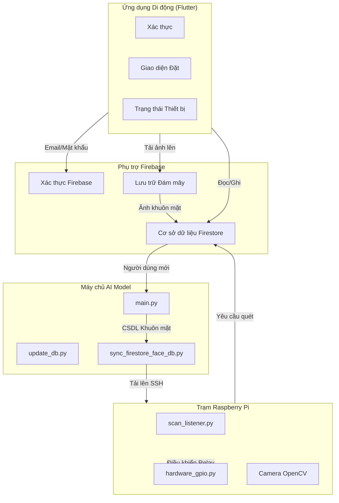
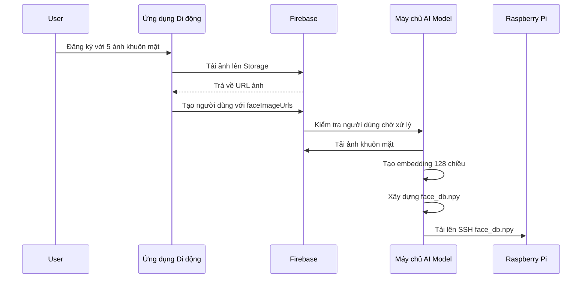
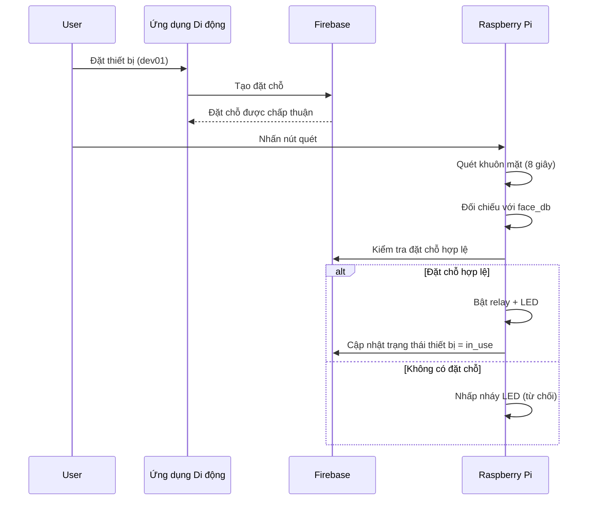
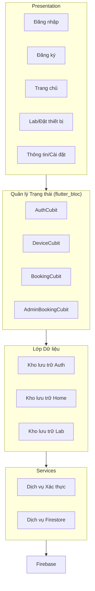
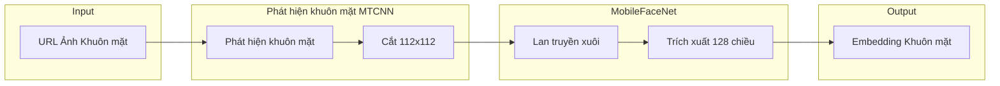
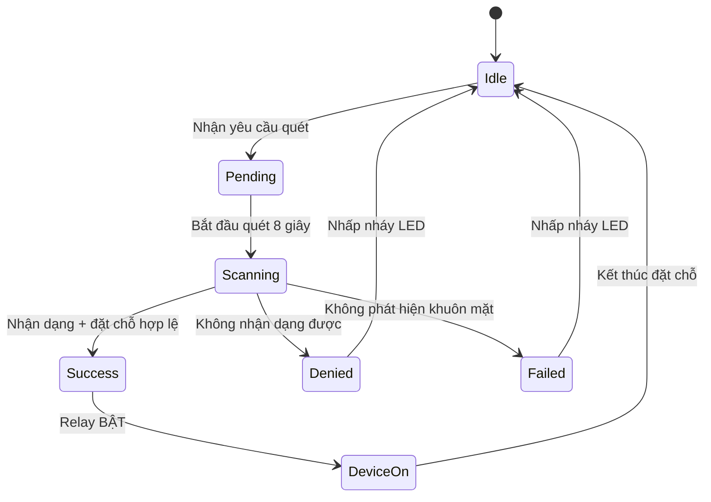

# Kiến trúc Hệ thống

## Tổng quan

Hệ thống PBL5 Lab Manager bao gồm ba thành phần chính giao tiếp qua Firebase như kho dữ liệu trung tâm:

1. **Ứng dụng Di động** - Ứng dụng Flutter cho xác thực người dùng, đặt thiết bị và giám sát thiết bị
2. **Máy chủ AI Model** - Mô hình nhận dạng khuôn mặt PyTorch để tạo embedding
3. **Trạm Raspberry Pi** - Bộ điều khiển phần cứng với khả năng quét khuôn mặt

## Kiến trúc Cấp cao

## Sơ đồ Dữ liệu

### Luồng Đăng ký Người dùng

### Luồng Truy cập Thiết bị

## Kiến trúc Thành phần

### Kiến trúc Ứng dụng Di động

### Pipeline Mô hình AI

### Máy trạng Thái Raspberry Pi

## Cấu hình Pin Phần cứng

| Pin GPIO | Chức năng | Thiết bị |
|---------|----------|--------|
| 17 | Đầu vào | Nút Quét |
| 22 | Đầu ra | LED (dev01) |
| 23 | Đầu ra | LED (dev02) |
| 24 | Đầu ra | LED (dev03) |
| 27 | Đầu ra | Relay (dev01) |
| 5 | Đầu ra | Relay (dev02) |
| 6 | Đầu ra | Relay (dev03) |

## Giao tiếp Thành phần

| Từ | Đến | Giao thức | Dữ liệu |
|------|-------|---------|------|
| Ứng dụng Di động | Firebase | REST API | Dữ liệu Người dùng, Đặt chỗ, Thiết bị |
| AI Model | Firebase | REST API | Embedding người dùng |
| AI Model | Raspberry | SFTP (SSH) | face_db.npy |
| Raspberry | Firebase | Firestore SDK | Yêu cầu quét, trạng thái thiết bị |
| Raspberry | Phần cứng | GPIO | Điều khiển Relay, LED |

## Cân nhắc Bảo mật

1. **Dữ liệu Khuôn mặt**: Lưu trữ dưới dạng embedding 128 chiều, không phải ảnh thô
2. **Truy cập SSH**: Raspberry Pi chỉ truy cập được trong mạng cục bộ
3. **Quy tắc Firebase**: Kiểm soát truy cập dựa trên vai trò trong quy tắc bảo mật Firestore
4. **Xác thực Đặt chỗ**: Xác thực dựa trên thời gian ngăn chặn truy cập trái phép